 
 

# 2018 Orphanage Trip Driving Instructions

# Before We Start

## Ways to Use these Instructions

These instructions can be accessed two ways:

* As the web page you are reading now.  If you don't have to worry about roaming charges, 
  you can simply leave this page open.
* As a paper handout; see Dianne.
* As a PDF file in your smart phone or tablet.  The iPhone, for one, has *iBooks* which
can hold a PDF file in your smart phone's memory and access it.  Once loaded,
you don't have to have a live Internet connection; this is handy when you want to
turn off access in México to avoid (expensive!) roaming charges.  **You can get the
PDF from Scott.**

## Things You Need

1.  **Does everyone in your party have a passport?  If not, now is a good time to go retrieve it!**
1.  **Do you have $11 for tolls charged by the Ensenada Scenic Highway?  $11 covers the cost in both directions.**
1.  Have a means to have Mexican insurance.  Either buy it (from Auto Club for example) before Saturday or be ready
    to buy it with the group when we get close to the border.

# Driving Instructions to Orphanage from Dianne's House

## Overview
1.  Starts from Dianne's house.
1.  Ends at the orphanange in Ensenada.
1.  You should preferably have a navigator reading these instructions.

Here's an overview map of the trip:

You can see that I've broken this into two stretches:

* From Dianne's to almost the Border (**McDonalds**) at **707 W San Ysidro Blvd, San Ysidro**.
* The drive in **México** to the **orphanage**.

## Instructions to the Stop Before the Border - McDonalds/Mexican Insurance

Starting point is **Dianne Lundquist's house**:

> 5141 Chateau Circle 
> Irvine, CA 92604

1.  Use the ways you already know to head south towards **San Diego** (on the **5**
 or **405**; doesn't matter).
1.  After the **El Toro Y** (the confluence of the **5** and **405** freeways), continue for
approximately **87 miles** on **Interstate 5**. *Note: do NOT take the **805**; stay on the **5***.
1.  Exit at **Dairy Mart Rd (Exit 2)**.
    
    

1.  After exit, turn **left at signal**.    
1.  Cross over freeway, then turn **right at signal** at bottom of hill.
    
1.  Drive just past **McDonalds** on the left, then turn left.
    

You will see other members of the team parked there.
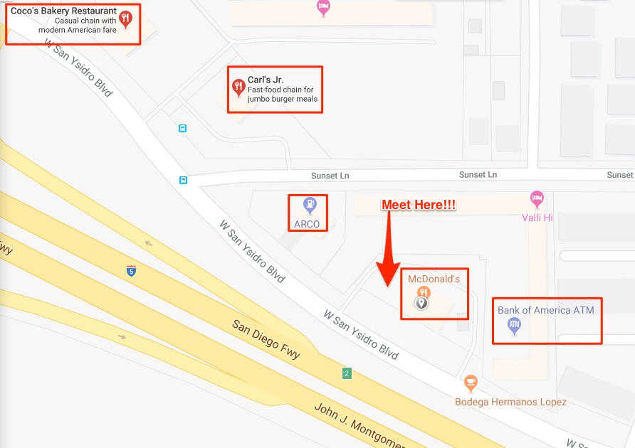
Some things to consider:

1.  Breakfast: **McDonalds**, **Carl's Jr**, or **Coco's**.
1.  Restroom break: any of the above.
1.  Buy gas (**Arco**) if you don't have enough to get back w/o filling up.  I've filled up
    in Ensenada, and I didn't observe any adverse effects to my car, but if you're worried
    about it, buy gas here.
1.  Also, have about $11 available for tolls on the beautiful Ensenada Scenic Road.
    They take US dollars.  Checkout **B of A ATM** if you forgot.

## Crossing the Border

### If you haven't driven in México before

Relax.  It's not that hard.  The biggest fear I've seen in newcomers is getting
lost.  Fortunately, there are not that many turns to make on this phase of the
trip, and this document makes a huge effort to make sure you make the turns you
need to make.

Other observations:

1.  People drive much slower in México.  Unlike the United States where we try
    to make the roads as safe as possible (and drivers get so bored they talk
    on their cellphones and cause accidents), roads in México are more primitive
    and you HAVE to pay attention (which is a GOOD thing).  Fortunately, we're
    driving in daytime, and the landmarks you need to see are not hard to spot.
1.  Drivers are courteous in México; be courteous to them.  I see much less
    reckless driving in México than in the states.

### Turn off roaming in your smartphone

Unless you have international roaming, you could be hit with a really nasty charge
on your next bill.

Besides, if you downloaded this document into your smartphone, you won't need
internet connectivity anyways.

If you don't know how to stop roaming on your cellphone, then put it
into *Airplane Mode*.

### First, Mexican insurance for those that need it:

1.  Turn left out of parking lot onto **San Ysidro Blvd**.
1.  Turn left at **Park Ave**.  **Sanborn's Mexican Insurance** is on
    the far left corner of **Park Ave** and **San Ysidro Blvd**.
    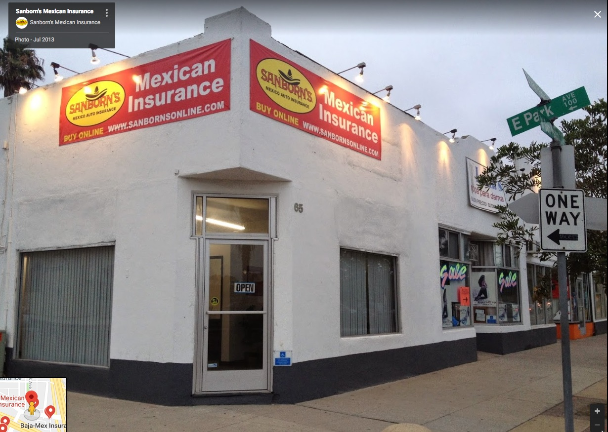
1.  Park and go in to purchase insurance.
1.  Finally, after everyone has bought insurance, we'll all line up
    behind the orphanage's red and white van and
    cross the border.
1.  Follow the van which will turn left back onto **San Ysidro Blvd**.
1.  The van will turn right onto the **805** southbound lane.
    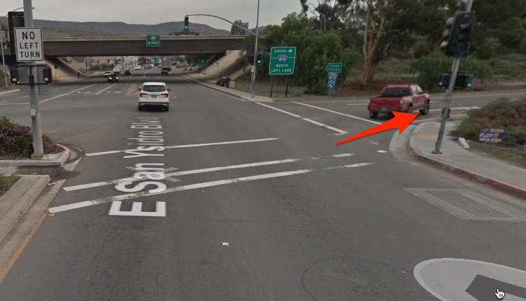
1.  Follow the van as it crosses the border.

> *Be sure to follow the van; they will know where to stop for customs.*

### We're going to stop for customs first.

We'll drive across the border following the orphanage's red and white van and, in a hundred feet or so, will pull
into a parking area and stop.

1.  ***We will go over as a group because Mexican customs wants to see us as a group.
    Don't go off on your own yet!***
1.  ***Important:*** **Follow the nuns' instructions here.  They have a plan to get
    us in and out of Mexican customs quickly.**

### Starting the Border Crossing - Inspection (Customs)
1.  Start going through the **border**:
    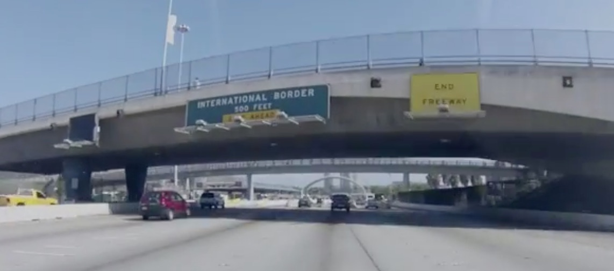
1.  Use **autos only** lanes: 
    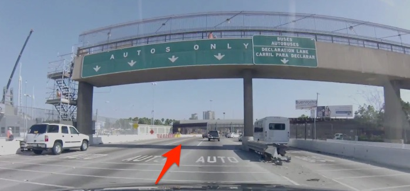
1.  Make a **sharp right** turn: 
    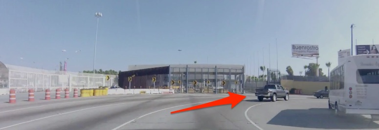
1.  Move over into the **right langes** to be ready for the **Playas** turn off: 
    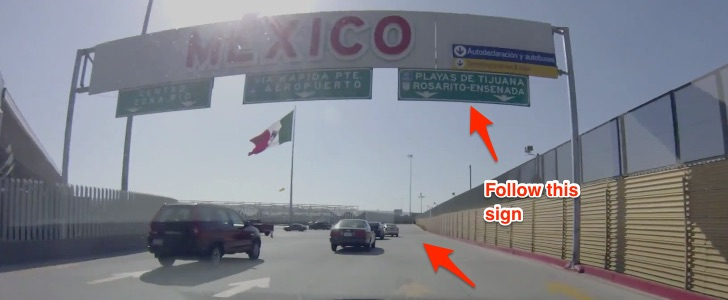.
1.  The van will pull over to a large open area to the right of the **sharp left** curve in the road.  ***Follow the van***.  The
    van will pull into a structure designated for travelers having something to declare.  Pull into a parking
    spot in the structure and turn off your engine.
    
### While in the structure

You can walk around, visit (kibbutz).  Inside the building they have plenty of public restrooms.
At some point, a customs inspector will ask to see the contents of your car; go ahead and help them do so.

Eventually, everyone will again line up behind the van and again follow it into the next facility which
is the customs area.
So you will quickly park in a new spot.
This won't take long at all; basically customs will inspect the cars missed at the previous
facility.

At the end of this phase, you are free to travel on your own to the orphanage.
You can follow the van if you want, but you are not
"required to".  These instructions should be sufficient to guide you the rest of the way.

## Driving the Mexican Portion

1.  When you leave the customs area, you  will quickly encounter the **Rosarito Ensenada exit** sign; follow it: 
    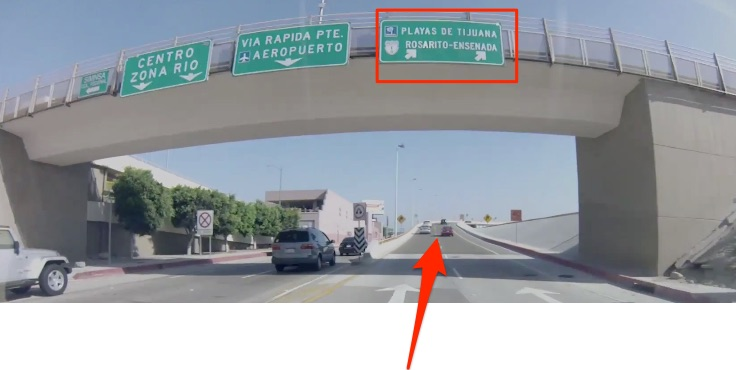
1.  This will put you on the highway running along the international border.
    Continue for about **2.5 miles**.  Along the way you will drive up a steep hill, the road will
    turn to the left, and you will go down almost as steeply.  Watch for the **Ensenada** turn-off
    and take the exit: 
    
1.  Drive about **58 miles** on the beautiful Ensenada Scenic Highway.
    You will go through **all 3 tool booths**; here's the last one: 
    
1.  At this point, the **Scenic Highway** ends and becomes
    a 4-lane highway with signals.  We're on the outskirts of **Ensenada** now;
    here's an overview map for the remainder of the trip: 
    

Continue with the *remaining* instructions:

1.  Continue for about **4.5** miles and bear **left** onto **Bahía de La Paz**: 
    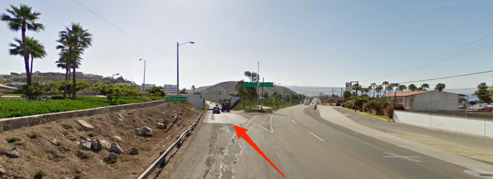
    

1.  Continue for **2** miles and **merge** onto **Calle Diez**: 
    
    

1.  Continue for **0.7** miles, then **turn** right onto **Av Riveroll**: 
    
    

1.  Turn left at the first intersection (**Novena**): 
    
    

1.  Continue for **0.5** miles *continuing past* the **extra** store on the **right**: 
    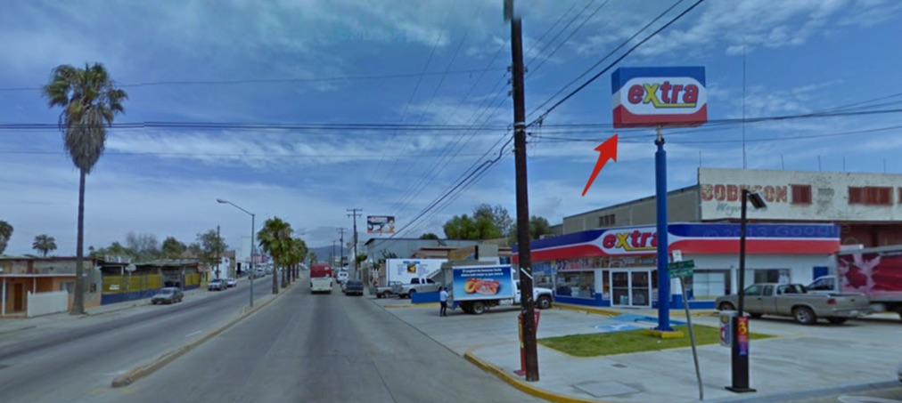
    

1.  Keep going straight.  At the end of the block, turn **right** (**Av Hidalgo**): 
    
    

1.  Continue past **one block**, then the **orphanage** is on the **right**: 
    
    The **black metal gate** will be open and you can drive into the courtyard.
    
The orphanage address is

> Colegio Guadalupe Victoria 
> Av Hidalgo 787, Obrera 
> 22830 Ensenada 
> B.C., Mexico    

*Congratulations, you have arrived!*

# Are You Staying at the Estero Beach Resort?

Reasons to Do So

1.  Beautiful night stay at a reasonable rate.
1.  Excellent on-premises restaurant.
    * Even though the nuns feed us lunch and dinner, it's fun to get together for a meal with the others.
    * The same restaurant offers an outdoor Sunday brunch right on the beach/bay.
      I consider this the highlight of the trip; if you haven't done this,
      consider sitting watching the waves and the pelicans in the warm sun with a hot cup of
      coffee in your hands to be a *mandatory* bucket list event.
1.  As important as the above are, an even more important reason is that you get
    a **Fast Pass** certificate.  This enables
    you to cross the border going back in a small fraction of the time you would otherwise take.
    Last year it only took 20 minutes from when we arrived at the gate where
    they process the certificate to when we
    drove past the border agent and were driving on US highways again.
    Without the pass, it will take hours to get across.

# Driving Instructions from Orphanage to Estero Beach Resort

Here's an overview map of the trip to **Estero Beach**:

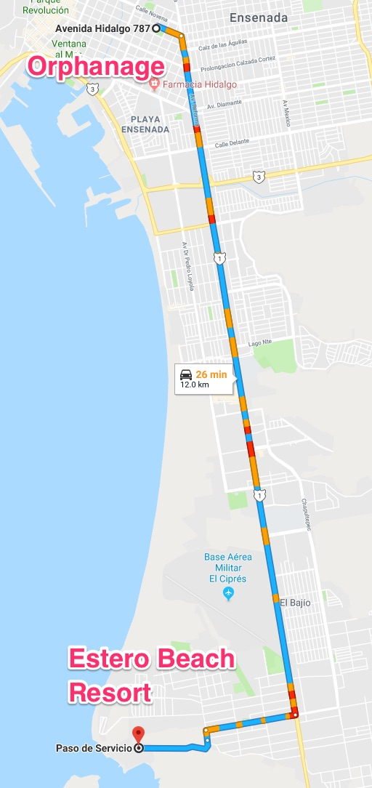

Here's the **orphanage** address that you're starting from:

> Colegio Guadalupe Victoria 
> Av Hidalgo 787, Obrera 
> 22830 Ensenada 
> B.C., Mexico    

## Use Google Maps

If you have a cell phone w/ free Mexican roaming service, you can
click on the following URL or copy and paste it into
your smart phone's browser:

https://www.google.com/maps/dir/Av+Hidalgo+787,+Obrera,+22830+Ensenada,+B.C.,+Mexico/31.7783925,-116.6135683/@31.8159713,-116.630355,13.18z/data=!4m8!4m7!1m5!1m1!1s0x80d8927852c6c6c7:0xc393f52602284365!2m2!1d-116.6110487!2d31.8655246!1m0
 
instead of following the route instructions below.
    
1.  It leaves from the orphanage.
1.  It drops you off right next to the Estero Beach hotel's office.
    
## Route Instructions
    
If you cannot use Google maps, here are the instructions to **Estero Beach** that I've
copied from Google maps:

1.  Pull out of the court yard and turn **left** onto the street
    in front of the orphanage (**Av Hildago**)
1.  Turn **right** at the first street you come to (**Calle Octava**)
1.  Turn **right** at the busy boulevard (**Av Reforma**): 
    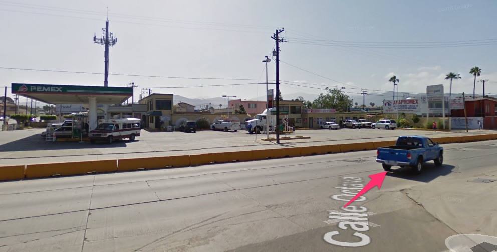.
1.  Drive virtually straight for **5.5 miles**.  It turns into **Highway 1**
    so you know you're on the right route.    
1.  Look for the Estero Beach Resort sign on the right: 
    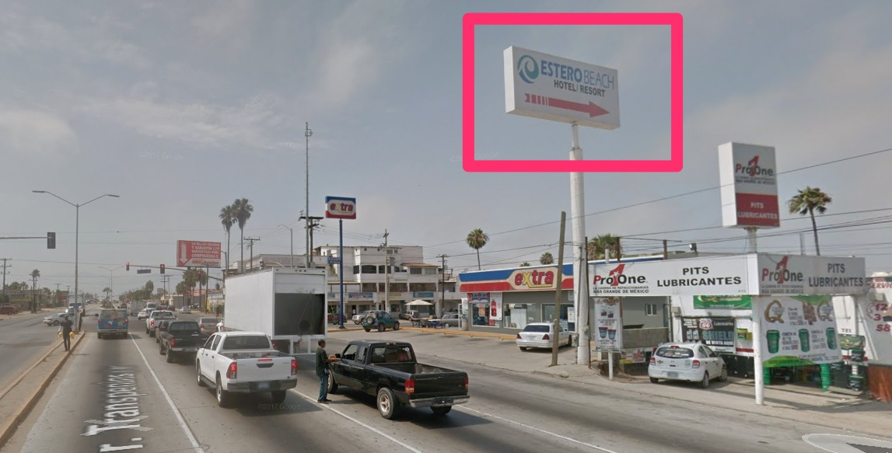
1.  Turn **right** at the next street (**Av Gral Lazaro Cardenas**). After
    turning, it should look like this: 
    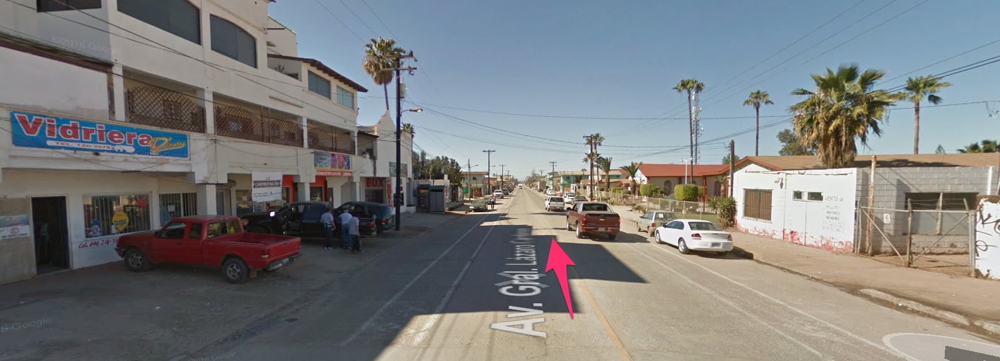
1.  Drive to the end of the street where it "tee's" into
    **California y o Tercera**: 
    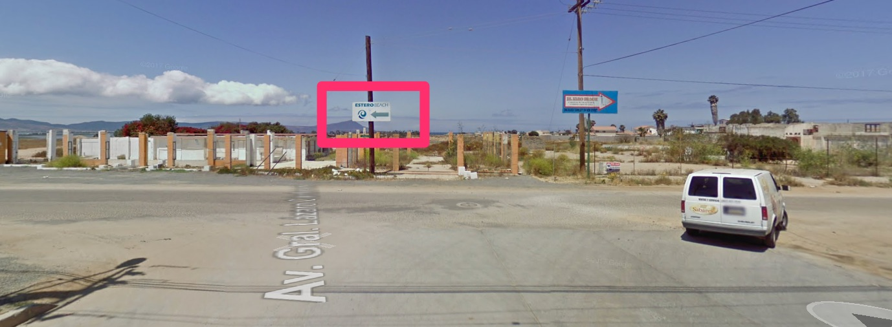
1.  Turn left, and drive until you get to the Estero Beach Restort **entry gate**: 
    
1.  Inform the **gate keeper** that you are a guest at the hotel.  He will
    permit you to proceed.  Follow this map to parking and then go into the
    office: 
    
1.  After arranging your visit, the staff will direct you to your room.  Be
    sure to inquire about acquiring a **Fast Pass** that will substantially
    reduce your time to cross the border when you return.
    
It is a beautiful place.  Walk around a bit; find your room and then go to
the restaurant where the "old-timers" will be waiting to greet you.

# Return Trip for Fast Pass Holders

## Fast Border Return

If you stayed Saturday night at **Estero Beach Resort** or ate at
a nice Mexican restaurant, be sure to ask for a "fast pass" certificate.
You can use this to cut your
border crossing time from >3 hours to 20 minutes; well worth it.

### Using Google Maps Directly

If you have a cell phone w/ free Mexican roaming service, you can
click on either of the following URLs or copy and paste it into
your smart phone's browser:

Here's the 2018 route which chose the drive right along the border.  It is faster
but has more turns, some of which are tricky the first time you use it.

https://www.google.com/maps/dir/Unnamed+Road,+Estero+Beach,+22785+Ensenada,+B.C.,+Mexico/32.5364198,-117.0281136/@32.1678603,-117.0850363,10z/data=!3m1!4b1!4m9!4m8!1m5!1m1!1s0x80d89026002c793b:0x4ab09b6cc9e0bcdc!2m2!1d-116.6138712!2d31.7782041!1m0!3e0

For this reason, I was asked to provide this route as well.  This does NOT hug
the border but is straight through and saves two turns, especially the last turn.

https://www.google.com/maps/dir/Unnamed+Road,+Estero+Beach,+22785+Ensenada,+B.C.,+Mexico/32.5364198,-117.0281136/@32.1601301,-117.1380708,10.11z/data=!4m14!4m13!1m10!1m1!1s0x80d89026002c793b:0x4ab09b6cc9e0bcdc!2m2!1d-116.6138712!2d31.7782041!3m4!1m2!1d-117.0492103!2d32.5343596!3s0x80d949097de116ad:0x3c2e1221b829a16c!1m0!3e0

1.  Either of the above take you from the Estero Beach Hotel's parking lot exit
    to the **fast pass** gate in Tijuana.

### Drive to the US Border from Estero Beach Resort

If using Google maps in Mexico is not possible for you, I have documented the same
route directions in the next section.

1.  Exit the **Estero Beach Resort** by driving out past the guard gate.
1.  Turn right onto **Av. Lázaro Cárdenas**.
1.  Left at the signal (**Highway 1**).
1.  Drive **straight** up **Highway 1** for **4.0 miles**.
1.  You will drive upon a bridge which you'll recognize by the *yellow railing* on the right
    as shown in the picture.  Take the right offramp at the end of the bridge.
    In the picture, you can see the cloverleaf descending down to the road below: 
    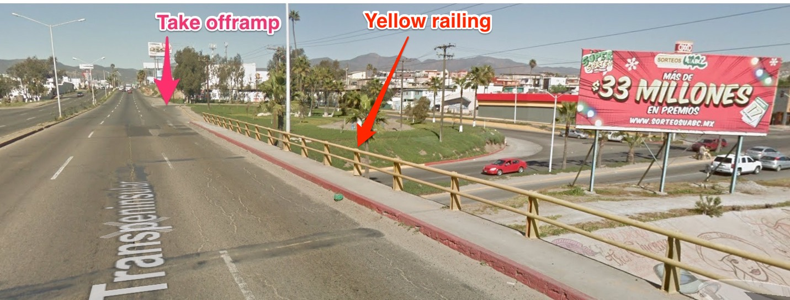
1.  Go straight through the first cross street (**Av_dr_Pedro_loyola**): 
    
1.  Turn right at the next cross street onto **Highway 3**. *Note it is probably not
    marked*: 
    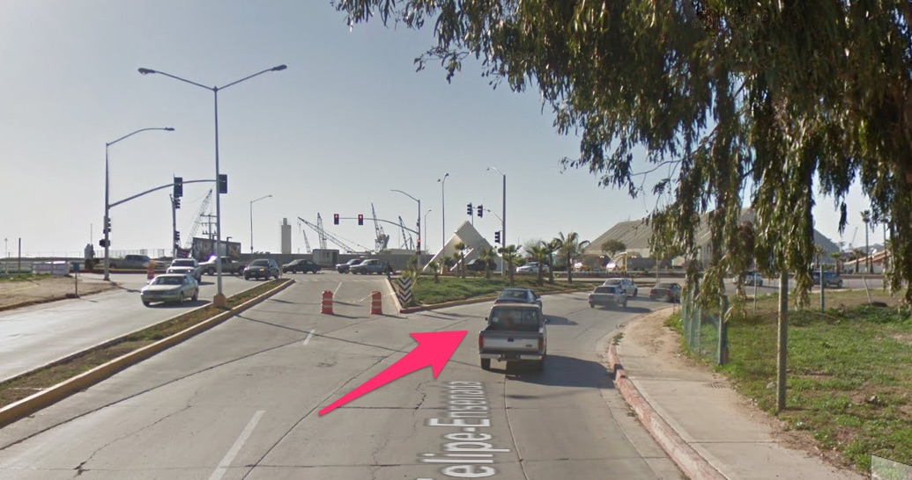
1.  Stay on **Highway 3** as it goes through the Ensenada seaport and then runs along
    the beach.  You will drive several miles until you reach a tiny freeway intersection.
    Bear **left** towards **Tijuana**: 
    
1.  Drive until you come to a fork where you choose to drive the scenic **toll** road
    or the free **libre** road.  Bear **left** onto the scenic toll road: 
    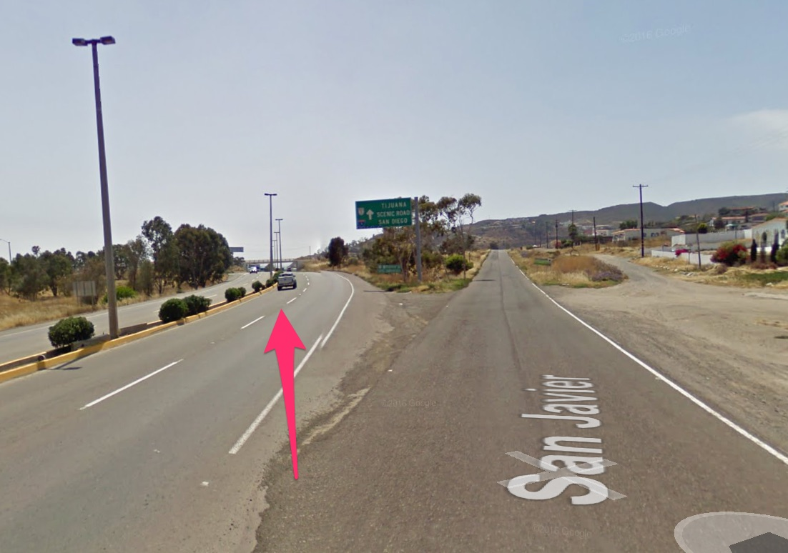
1.  You will arrive at the first toll booth.  Pay and proceed.

> Enjoy the scenic road.  When you are past the last **(3rd)** toll booth, it will be
> time to pay attention to the driving instructions again.
>
> If you followed these instructions last year (in 2018), you will notice
> that I've changed the last
> section to make the navigation easier.

1.  After the last toll booth, in a
    few miles you will notice you are climbing up a hill next to the **US
    border fence**: 
    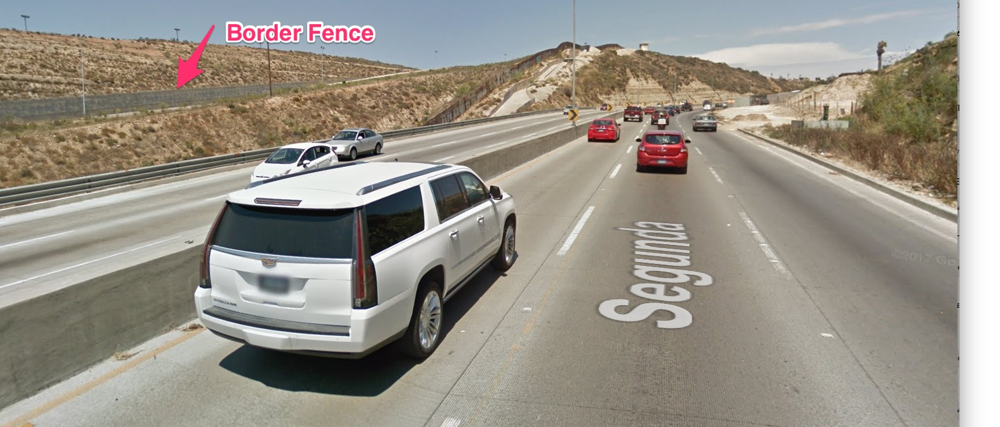
1.  You will climb to the top of the hill.
    As you come down, watch for the **San Diego** offramp but **DO NOT TAKE IT**;
    instead **GO STRAIGHT** as indicated by the arrow: 
    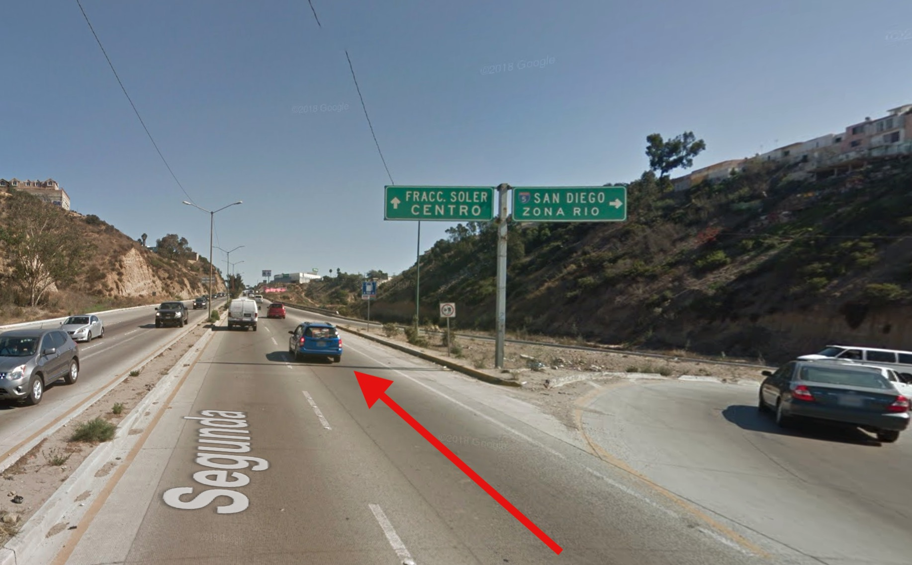
1.  Continue about 1.5 miles.  You will come to an intersection that another
    busy road merges onto.  Just keep going straight as shown here: 
    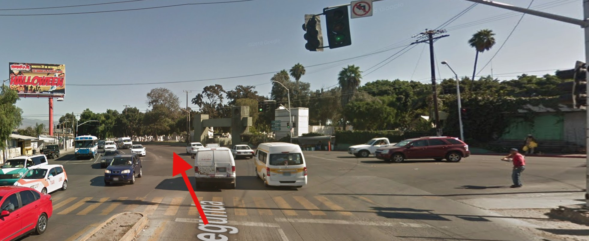
1.  Again continue about 1.5 miles.  Watch for an overpass carrying 5 signs to
    choose from.  Just take the **middle** one (**Col. Federal**); it is the one
    with the single lane: 
    
1.  You will make a long 360 degree circling up onto a bridge.  Keep
    going until you can bear left to a gate as shown here: 
    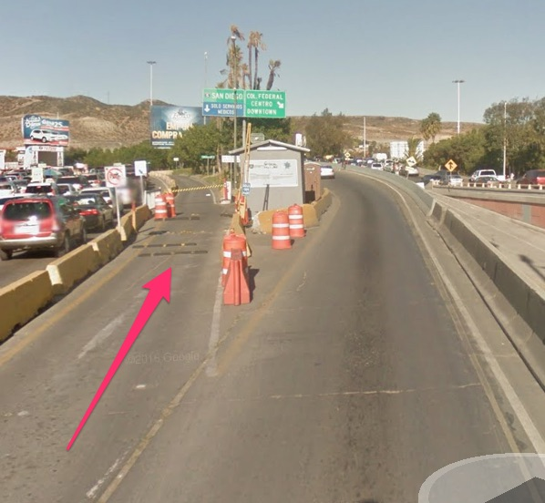
1.  There an official will process your **fast pass**.  It takes less than a minute to process;
    then he will open the gate for you, and your wait to cross the border
    will be cut by around 70% (or more).
    
Enjoy the goings-on as you wait to cross the border.  Be sure you have your
**passports** ready to hand over to the US border agents.

*Merry Christmas!  See you next year.*
